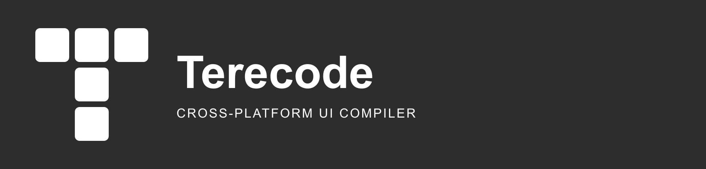

  

# Terecode — Brand assets

  Define once. Compile everywhere.

  <a href="../src/">source</a>

 

  

---

## 🎯 Purpose

Shared variant convention across the four organizations.

## 🎨 Variants

| Variant | Background | Artwork |
|---|---|---|
| Horizontal / vertical | Transparent | Brand-colored symbol, dark text |
| Dark lockup / wordmark | `#2D2D2D` | Solid white |
| Monochrome | Transparent | Solid black |
| Symbol / symbol-light / symbol-color | Transparent | Black / white / brand colors |
| Wordmark / wordmark-light | Transparent | Dark text |
| Favicon / avatar | `#2D2D2D` | Solid white symbol |
| Safari pinned tab | Transparent | Solid black symbol |

## 🛠️ Regeneration

PNG sizes: horizontal 2000×480, vertical 1200×1200, symbols 1024×1024, wordmarks 1600×400, favicons 256×256. Typography uses Arial with Helvetica and sans-serif fallbacks; no remote font imports.

Regeneration: `python C:/develop/phronesis-framework/assets/scripts/normalize-assets.py`. Requires `rsvg-convert`. Validation: append `--check`.
